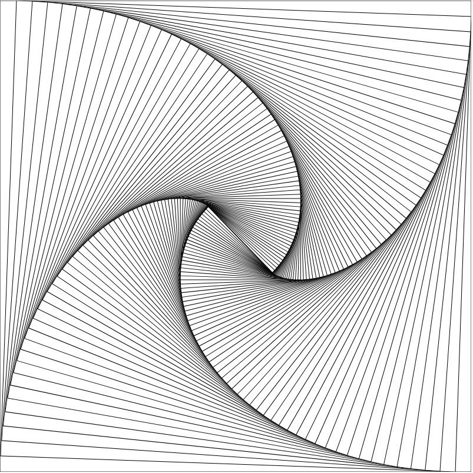

# draw-rectangles

Change angle/width/height in index.html for different output. Also see options at top of draw-rectangles.js.

Sample output:

## TODO

- Add better stop condition to prevent incorrect last rectangle
- Add step to draw lines connecting each rectangle to previous
